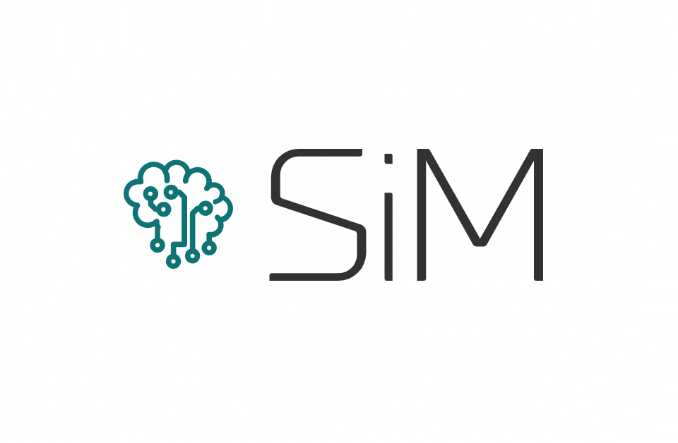

#  SimplyManaged

SimplyManaged is a smart rostering web application, serving as a tool for companies to manage and create rosters with ease. 

## Technologies Used

1. Frontend: React
2. Backend: ExpressJS
3. Database: MySQL with PlanetScale (Free tier)
4. Prisma ORM 
5. Nodemailer for email services


## Installation

After cloning and navigating to the root folder of the project, run the following commands to install the required dependencies:

```
cd client && npm clean install
```
```
cd server && npm clean install
```

## Getting Started

Before running the application locally, you will need to create a .env file for your local development. You can refer to the .env.sample file in the server folder and add your own database connection string, a random JWT secret string, and the username and password of the SMTP server you will be using. 

Once you have the .env file ready, you can start up the client in development mode via the command:
```
cd client && npm run dev
```
and start up the server in development mode via the command:
```
cd server && npm run start:dev
```

## Team Members of FYP-23-S3-22

| Name | UOW ID | Email |
| ---- | ------ | ----- |
| Francheska Lazo (Leader) | 7685324 | lazo001@mymail.sim.edu.sg |
| Le Minh Vu | 7558909 | le084@mymail.sim.edu.sg |
| Tan Jing Jing | 7372759 | jjtan043@mymail.sim.edu.sg |
| Chua Zun Sheng | 7765915 | zschua003@mymail.sim.edu.sg |
| Jasper Lee Yong Ze | 7769398 | jjklee003@mymail.sim.edu.sg |
